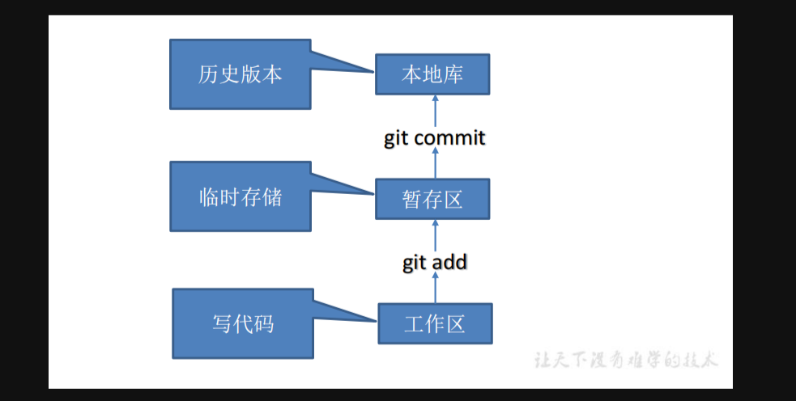
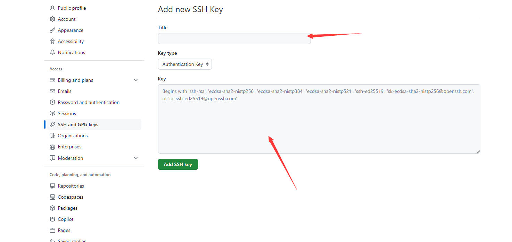

## 简介
Git是一个免费的、开源的分布式版本控制系统，可以快速高效的处理从小型到大型的各种项目。方便快捷管理所有文件版本。

普通文件通过git add加入追踪，不被追踪的文件不会被git管理。追踪的文件修改，git将改动保存至暂存区，通过git commit提交至本地仓库。本地仓管通过push和pull来和远程仓库进行改动文件交换。

#### git使用

##### 下载git

[下载地址](https://git-scm.com/download)

##### 安装git
一直点是

##### 工具地址
[git book](https://git-scm.com/book/zh/v2)

#### 常用命令

ssh key 目录地址
默认在用户admin目录下的.ssh中

生成ssh key：comment为任意文本，用于区别ssh key
`ssh-keygen -t rsa -C "comment"`

设置ssh key
以git hub为例，其他所有的服务器类似，都是通过将ssh key的公钥上传服务器，用于连接验证

创建git仓库
`git init`

指定远程仓库：url为远程仓库地址，可以是ssh连接形式，也可以是http形式
`git remote add url`

推送项目：origin为远程仓库名
`git push origin`

创建新的分支：branch为新分支名字
`git checkout -b branch`0

根据远程仓库中的分支，创建新的本地分支：branch为创建分支名字，origin_branch为远程分支名字
`git checkout -b branch origin/origin_branch`

切换分支：branch为切换分支
`git checkout branch`

查看暂存区状态
`git status`

git仓库添加文件：file为新加文件
`git add file`

提交：message提交信息
`git commit -m message`

推送：origin远程仓库名，可以通过git remote设置别名
`git push origin`

指定邮箱：email为自定义邮箱
`git config --global user.email "email"`

指定用户：user为自定义用户
`git config --global user.name "user"`