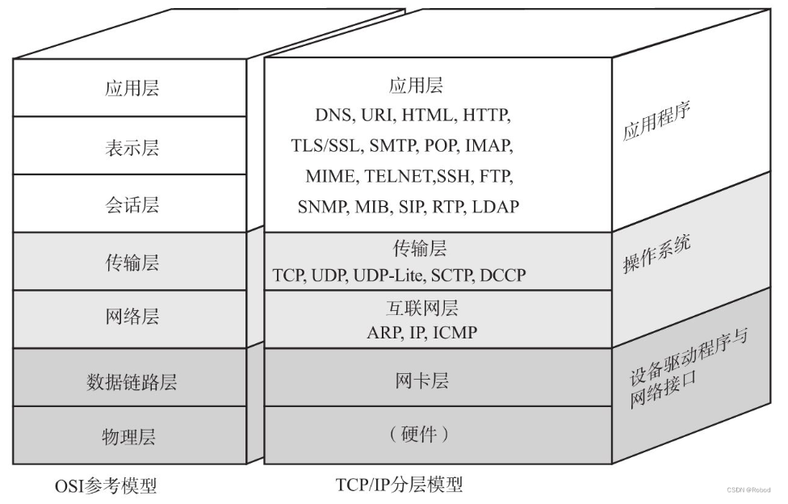

# [java基础](../java/基础/java基础.md)

---

# io

### java io模型

bio 即 blocking io（阻塞io）
nio 即 non-blocking io （非阻塞io）selector buffer channel 组成
一个线程有一个selector，多个buffer和channel，selector通过轮询进行通道选择

### java序列化

java对象序列化，对于jvm来说，反序列化就是将一段二进制信息读取后解析为对象的过程，所以这段二进制信息必须包括类信息和校验逻辑等等。包括以下部分序列化协议，序列化版本，类描述，成员变量信息，超类描述，超类成员信息，由成员变量引申出的类描述等等。

好处是方便快捷，java自带对象获取流，能快速建立网络加载流，包括class，对象等等。

坏处不能跨语言，容易收到攻击，序列化后数组大导致序列化效率不行和传输效率不行

### socket

socket是规范，用于不同操作系统使用ip和端口进行进程通讯。

java中的socket就是jvm对操作系统传输层的调用实现。

### tcp

tcp是一种全双工协议，为了保证请求方和接收方发送数据链路都是通畅的，并且数据传输的完整，需要进行三次握手四次招手。

三次握手，
请求方发送请求包
接收方接收请求包，返回确认包
请求方收到确认包，返回确认包，并准备开始传输数据

数据传输

请求方发送数据传输结束请求
接收方收到数据传输结束请求，返回确认包，告知收到结束请求
接收方完成所有的数据接收，返回结束包，告知接收结束
请求方返回收到结束请求，完成数据传输

### http

###### 结构

请求头：url，请求类型（get，post），cookie，content-length，content-type等等

正文：post请求正文一般不为空，类型由content-type控制

响应：状态码反应请求结果

###### 重定向

状态码3xx表示重定向，301表示永久重定向，浏览器更新所有链接。302，表示临时重定向，浏览器下次访问旧链接

###### 长连接

http1.0默认是短连接，TCP连接建立后，http使用完就进行释放，导致多次TCP连接

http1.1默认长连接，当主动断开连接或者连接超时才释放TCP连接

### websocket

和http协议同级，基于tcp协议的长连接，使用http协议进行tcp连接建立，然后

### netty

##### 同步异步模型

#### io多路复用

---

# 多线程

### java多线程

##### 线程池实现

##### 锁

##### 线程通信

##### 操作系统实现逻辑

---

# jvm

### 内存分布

### 垃圾回收

---

# 数据库

### 关系型数据库

##### mysql

##### 数据库设计范式

### nosql

##### redis

##### MongoDB
---

# 框架

### spring

### springmvc

### springboot

### mybatis

### mybatispuls

---

# 分布式

### 原理

---

# 中间件

### 注册中心

---

# [算法和数据结构](../计算机基础/算法/LeetCode/0、概述.md)

---